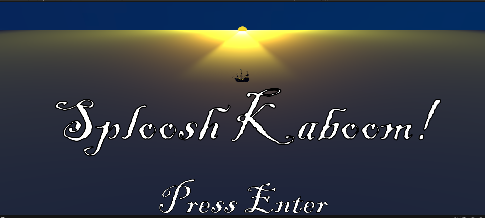
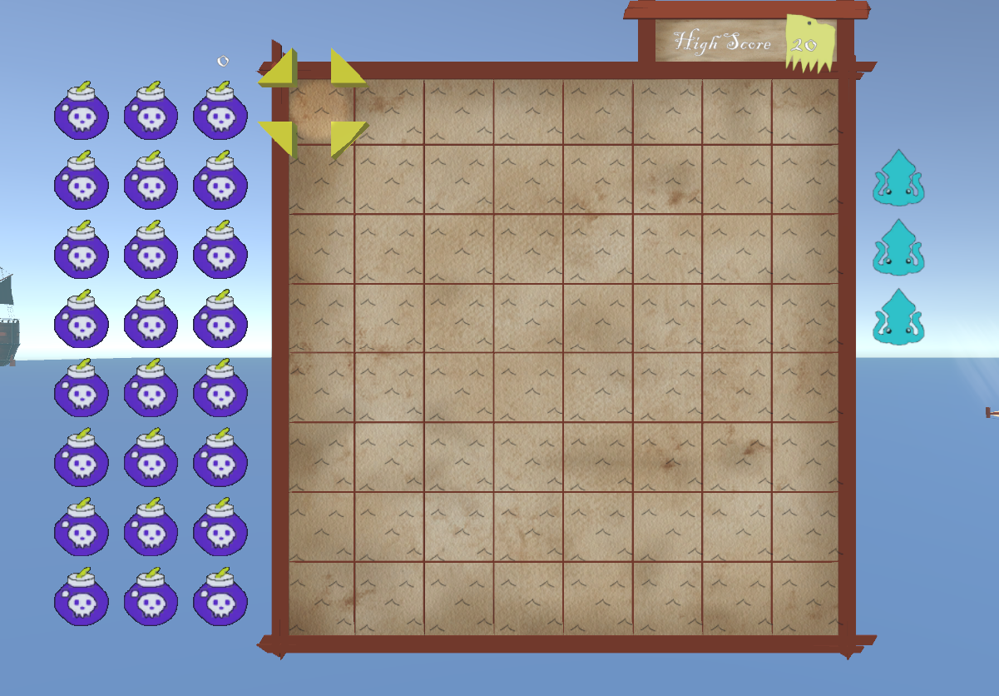
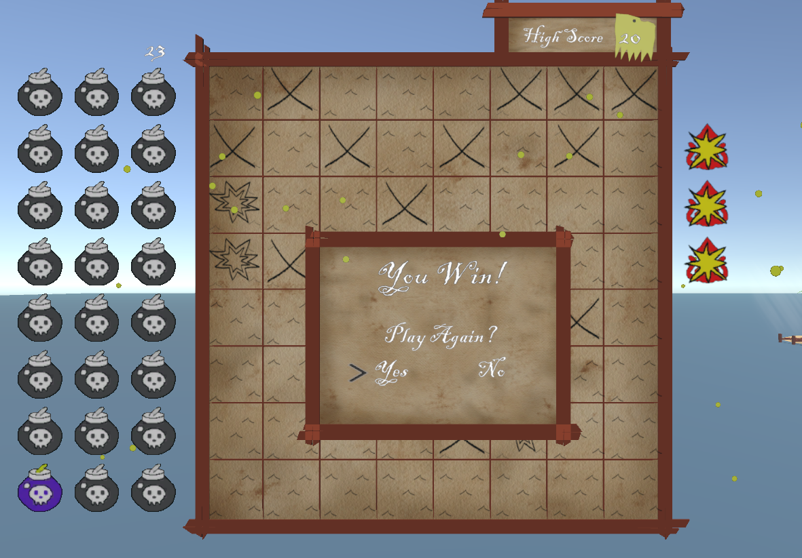
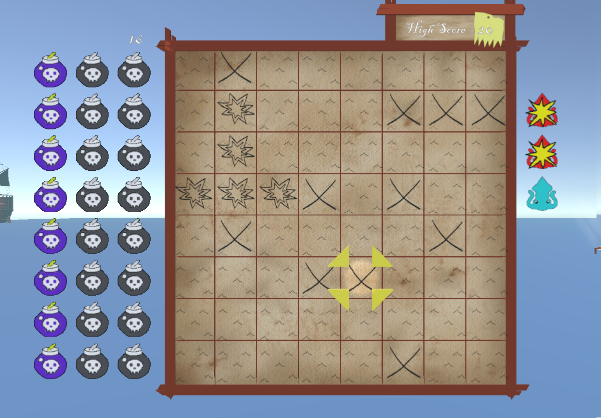
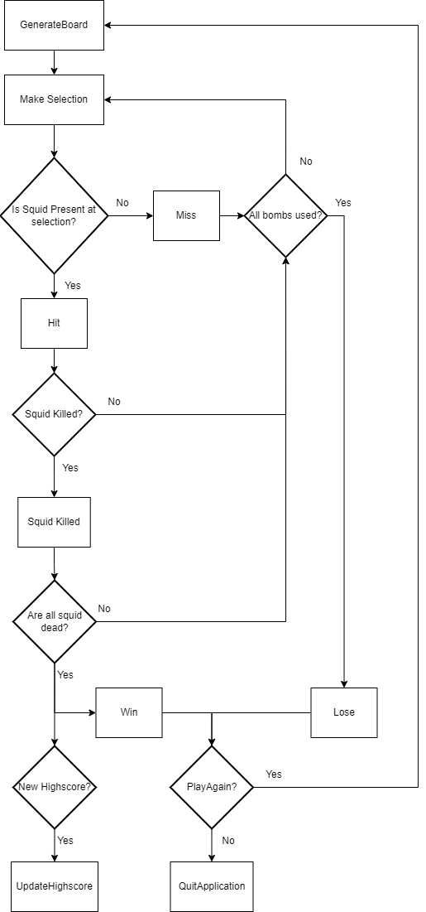

# Sploosh Kaboom

Sploosh Kaboom is a remake of an existing mini-game from the popular
title by Nintendo: "The Legend of Zelda, WindWaker". The mini-game is known
by the community as either "Sploosh Kaboom", "Squid Hunt", or “the worst mini-game in the Legend of Zelda Franchise”. A link to the wiki
explaining the mini-game is here: https://zelda.fandom.com/wiki/Squid-Hunt.
The reason for this strong reaction is due to the large amount 
of luck that players must have in order to beat the mini-game with a good score.
As a result players often spend a large amount of time on this mini-game-
searing it into their memory. As a form of a twisted homage,
I wanted to recreate it in Unity.

Video of game play:

https://youtu.be/MpIgv9O2Dsw

## Game States

While not explicitly referred to as states in the code, there are three states:
-Start (Title) The game loads into the title screen, this is to introduce
the player to the game.

-Upon hitting the select key in the title scene, they are sent to the Play
Scene. This is where the game lies.

-Upon winning or losing the game, the cursor is disabled, the game's sound
effects are paused and a text box overlays appears with the appropriate text,
music and effects. This is the final game over state. From here the player is
given a choice to play again (reload the Play scene) or quit the application.

### Title Scene

### The Play Scene

The game displays a grid of 8 by 8 tiles. Above the grid is a high score indicator.
To the right of the grid are 3 squid images. To the left a grid of 24 bomb images.

*Initial setup of game*

### GameOver state (win)

## How the game plays

The premise of the game is simple, and plays very similarly to Battleships.
There are 3 squids on an 8 by 8 grid that you have to find. These squids 
are 4 parts long, 3 parts and finally 2. They are randomly placed and 
travel in straight lines (no diagonal squids!). When the game starts
you have no idea where they are, so with a lot of guesswork you must 
select a square on the grid where you think a squid might be to fire
a bomb at it. Hit all the parts of the squid in order to sink (kill)
the squid. The player starts with 24 bombs, as shown by a grid of bomb
images on the left- a counter keeps track of the total number of shots made.
If the player can kill all 3 squids before running out of bombs then 
they win! Otherwise they lose. A high score keeps track of the number of bombs
needed to kill all of the squid- an initial value of 20 is supplied to give
the player something to beat.

*The game in play- 2 squids dead, 16 bombs used*

## The Mechanics.

The player has only 5 controls in this game: up, down, left, right and select.
These have been mapped to the standard WASD and also the arrow keys for
accessibility. ‘Return’ or ‘Enter’ can be used to select. On playing the
game they use the controls to move the cursor on the board in the 4 cardinal
directions. When they want to make a shot and fire a bomb, then the player
hits select. If there was a part of a squid there, then the grid tile will
change to an explosion image, and a kaboom sound effect will play letting the
player know they have hit a squid. If there is no squid then a tile will show 
a big X and a sad sploosh sound effect will play. If all the parts of a squid 
have been killed then a new SFX plays letting them know something happened-
and one of three squid images will be crossed out. This helps the player keep 
track of how many squids are left.

## Assets & Features

I have used pre-made assets to enhance the experience of the game- namely sound effects
and 3d assets from the Unity asset store to produce a pirate theme.

The title scene is my own arrangement, using the pre-made pirate ship asset
as the focal point. In the Play Scene. I used a free
tropical island asset pack to set the theme of the game. The game 
board is a prefab I made using planks of wood assets from the tropical
island assets and stretching and laying them down on top of each other-
making a grid. The background of the board is an image of parchment I
found stretched over. 

Each tile that is spawned over the top of the board, is a prefab that
holds a series of materials that pertain to its state (i.e start, hit, miss)

Using inspiration from the Wind Waker mini game, I have drawn the bomb and
squid images that lie to the left and right of the game board during Play.
Every action must have a good feel. That is why I have made movement
of the cursor as smooth as possible and have every action by the player
be met with a response from the game. This is achieved by visual changes
to the board and sound effects. Using inspiration from the original game,
I have recorded the sound effects that are made during the game- so if
they sound weird- that’s why!

The cursor is my first foray into blender. I thought a 3d cursor would
look better than a 2d one- as the game camera is using perspective.

The GameOver state is a prefab made in a similar construction to the board. If 
the player wins the game, then a particle system is played and a coin sound effect is played.
Otherwise a lose sound effect is played.

### Screen transitions
Between the Title scene and play scene I have implemented a 
circle wipe to make the transition smoother and more playful. 
I have used the same transition upon the player winning and losing to make the
end transition less jarring. The scene transitions were my first attempt at 
animations in Unity, and I am quite happy with the result!

## The technicals

### Game Flow

*Game Flow Diagram*

The flow diagram above details the general logic that the game follows. It forms
the framework that a central "Game Controller" can use to process the games inputs 
and manage the outputs.

I have tried to centralize most of the logic into what is called the GameController. When the game starts,
the controller makes a call to the board manager to generate a new board.
After this, the controller waits to receive input from the user through 
the cursor controller. Once a selection has been made by the user, the Game
Controller recognizes which tile has been selected, then proceeds to handle
the logic and pass the result to the appropriate managing classes that may 
need their states updating.

### Board algorithm
The algorithm needed to randomly place the squids at the start of
the Play Scene is probably the most complicated bit of code I have.
It has been inspired by the work of
(https://github.com/petersn/web-sploosh-kaboom).
How it works generally is that I have a two dimensional array of
Tile GameObjects. Each of the Tiles holds state- it knows whether
it has been selected, it knows if there is squid present in the tile
and which one it is. When trying to place the squids the algorithm
iteratively scans the two dimensional array of tiles trying to assign
the squid to the tile, without any part of the squid overlapping with
another squid or extending beyond the bounds of the array. 

## Credits:

Squid placing algorithm help:
https://github.com/petersn/web-sploosh-kaboom

All assets used have a free license at point of writing 
Standard Unity Asset Store EULA (Extension Asset)
Low Poly Tropical Isalte Lite- (Unity Asset Store) - Oleh Lila
Stylized Pirate Ship (Unity Asset Store) - Maksim Batyrev
Mixkit Sound Effects Free License
Win sound effect-  https://mixkit.co/free-sound-effects/game/
Mixkit-final-level-bonus-2061
mixkit-clinking-coins-1993

License: Creative Commons 0
Loase Sound effect- Fail Sound Effect - Accoustic Guitar by florianreichelt -- https://freesound.org/s/412427/ -- 

Parchment Image- VWolfdog, https://opengameart.org/content/parchement-textures

License Pending:

Background music- Legend of Zelda WindWaker, Nintendo

